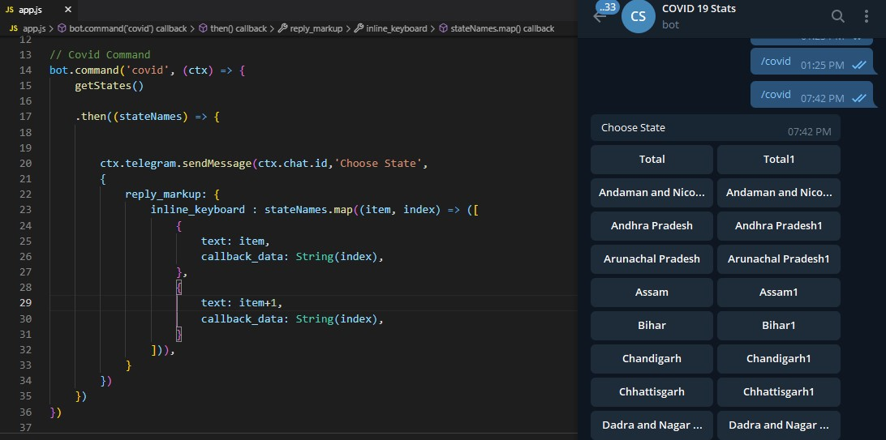

# Covid19-Stats-bot
 Telegram Bot COVID-19 related statistics.

I have an array 'stateNames' I want to show state names on two buttons with one row. 

Open app.js file. I'm facing an issue on line 13 // Covid Command 

